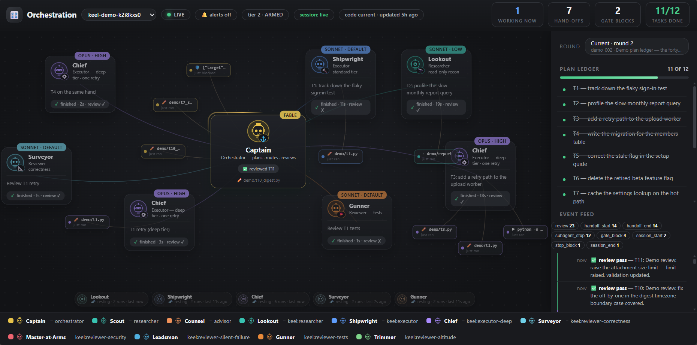

# keel

[](https://github.com/policyon/keel/actions/workflows/keel-ci.yml)



▶ [Watch the 40-second demo tour (webm)](https://github.com/policyon/keel/releases/download/v0.6.0/Keel-demo-tour.webm) — the dashboard above, moving: a refused write, a wave of agents, a failed review earning a deeper retry, a blocked stop.

keel is a governed agent harness: the structural spine under an AI coding
session. It gates writes behind an approved plan and closes sessions with
accounting that is verified against an append-only audit log rather than
trusted; it locks the policy against the model's own hand — refusing direct
writes and the mutating shell forms it recognises, recording every refusal and
most of what it cannot classify, with the guard's measured reach and its
known-open routes both named in
[docs/keel-trust.md](docs/keel-trust.md); it captures knowledge into plain
markdown files under a hard injection
budget; and it adopts an existing setup without deleting anything. Files are
the record, everything else is a rebuildable cache. Zero dependencies, zero
telemetry, zero network calls in the kernel, zero model calls of its own.

**Status: pre-alpha — kernel armed, knowledge and review layers landed.** The
gates, the observers, the command-line tools, the capture-to-retrieval
pipeline, the read-only reviewers and the orchestration skills are built, and
a CI workflow runs every repository check and the full test suite on three
operating systems on every push — green on Linux, macOS and Windows (the
badge above is live). keel is
armed on its own repository at
tier 2. The install path is the plugin marketplace (see
[Install](#install)); installing enforces nothing until a project arms
itself.

## See it first

No tokens, nothing written outside a throwaway directory:

```
python scripts/keel_demo.py --tour --serve
```

A scripted eight-beat tour plays into a fresh temp project and opens the
orchestration board at `http://127.0.0.1:8771`: a write refused for having no
plan, twelve tasks opening on the ledger, three agents fanning out at three
routing tiers, a review that fails and earns a deeper retry, a stop refused
for leaving an item open. It runs about forty seconds and then plays again as
a new round until you stop it with Ctrl-C — `--seconds N` sets the round
length, `--once` plays a single pass. Every session id in it carries a
`demo-` prefix, and the script refuses to run against any directory whose
audit log holds real work. Then read
[docs/keel-adopting.md](docs/keel-adopting.md) to pick the tier you would arm
at.

## Capabilities

- **Enforcement kernel** — plan-before-write, stop-with-accounting, policy lock, kill switches, audit trail.
- **Orchestration** — routing tiers, least-privilege executor and researcher agents, and the moor / ratify / refit skills: session close with accounting, standing decisions recorded the turn they are spoken, policy amendment by ratification.
- **Knowledge layer** — mechanical capture, inline distillation, derived search index, budgeted injection.
- **Review layer** — read-only specialist reviewers (correctness, silent failure, tests, security) under a structurally enforced house contract.
- **Adoption layer** — `survey` and `doctor` ship, and `/keel:lay` arms a
  project non-destructively: it backs up what adoption can touch, deletes
  nothing, and halts rather than proceed unbacked.

**Not built yet**, listed so the shape is visible rather than implied: an
importer for legacy record formats and adopter-side drift detection (the
rest of the adoption layer), and the **workspace layer**
(worktree-per-session isolation, port allocation) — both demand-gated,
neither built.

## Editions

keel is designed to cut into four bundles along the layer seams, from one
source tree and one feature registry — each a strict superset of the one
before it. **Today it ships as one tree**: you install everything, because
editions are generated bundles cut from this repository, not maintained forks.
The split becomes real once the first bundle is published.

- **keel-core** — the enforcement kernel and orchestration: the gates and
  the ceremonies, nothing else.
- **keel** (standard) — keel-core plus the knowledge layer: the gates and
  the ceremonies, plus the knowledge that remembers them.
- **keel-govern** — keel plus the review layer: the standard edition, plus
  reviewers who read what shipped.
- **keel-fleet** — keel-govern plus the workspace/viewer layer: the govern
  edition, plus the dashboard that watches the whole fleet.


## Commands

Nine skills ship, invoked in a session:

| Skill | Meaning |
|---|---|
| `/keel:lay` | Study the environment and lay keel down in a project |
| `/keel:castoff` | Orient a resuming session: read the last mooring, report what this state permits |
| `/keel:sound` | Interrogate the intent before planning, until understanding is shared |
| `/keel:log` | Distill the session's observations into knowledge records |
| `/keel:chart` | Search knowledge: index layer first, detail by identifier |
| `/keel:ratify` | Record a standing decision the same turn it is made |
| `/keel:refit` | Amend the policy under a controlled procedure |
| `/keel:wave-review` | Batch a completed wave's questions into one walkthrough |
| `/keel:moor` | Secure and consolidate state at session close |

Ten subcommands ship behind `python scripts/keel.py`:

| Command | Meaning |
|---|---|
| `keel survey` | Environment and registration report |
| `keel doctor` | Synthetic hook launches and a known-broken-pattern scan |
| `keel attest` | Reconcile a session ledger against the audit log |
| `keel leak-check` | Scan tracked files for content that must not leave |
| `keel records` | Check knowledge records against the governance schema |
| `keel index` | Derive the search index from the record files |
| `keel chart` | Search the records, then read them by identifier |
| `keel dashboard` | Read-only local viewer on an ephemeral loopback port |
| `keel debt` | Harvest deferred markers left in completed work |
| `keel review` | Append one review verdict to the audit log |

Each subcommand lists its own options with `--help`, and that usage output is
the authority — a table maintained by hand is a table that drifts.

## Why trust keel

keel's discipline is enforced by code, not asserted in prose: the exit code
is the decision, the policy that binds the model is guarded against the
model's own hand — a guard whose measured reach and whose known-open routes
are both named rather than implied — and every claim in the shipped documents
must resolve against the tree — a reference-integrity gate fails the build on
a cited path or rule that points at nothing. keel is developed armed on its
own repository, under its own gates.

The lock has been measured against itself rather than assumed: 28 probes, 18
refused and 10 allowed, with every path-shape evasion held and the routes that
got through named in the limits below. A guard that publishes the count of what
it did not stop is the point, not an admission.

- [docs/keel-why.md](docs/keel-why.md) — why enforcement instead of
  instruction, with each claim grounded in the check or test that holds it.
- [docs/keel-trust.md](docs/keel-trust.md) — the trust story: what the
  policy lock protects, what the gates guarantee, what never happens,
  graduated adoption, and the honest limits — including the measured routes
  the shell scanner does not refuse.

## Install

The single supported path is the plugin marketplace: no runtime downloads,
no `curl | bash`, no global binary. In Claude Code:

```
/plugin marketplace add policyon/keel
/plugin install keel@policyon
```

Installing arms nothing. keel ships unarmed — gates enforce only in a project
that carries its own `.keel/keel-policy.md` at an enforcing tier, and arming
is the adopter's own act (`/keel:lay` walks it).

What the install copies: the marketplace entry names `dist/keel` as its
plugin source, not the repository root. That bundle is committed, so an
install copies the bundle alone — never this repository's own session
records, tests or working material. `python scripts/keel_gen_editions.py
--distribution` rebuilds it; `python scripts/keel_checks.py --distribution`
fails if what is committed has drifted from what that command would write.

## Documentation

- [docs/keel-adopting.md](docs/keel-adopting.md) — which tier to start at and why: the four tiers as a choice, a first session walked through, and how to move either way.
- [docs/keel-why.md](docs/keel-why.md) — why keel exists: gates that decide, not prose that persuades.
- [docs/keel-trust.md](docs/keel-trust.md) — the trust model, audience by audience, limits included.
- [docs/keel-rules.md](docs/keel-rules.md) — the rules register: every design commitment and what enforces it.
- [docs/keel-conventions.md](docs/keel-conventions.md) — code conventions.
- [docs/keel-governance.md](docs/keel-governance.md) — release, triage, registration and reference rules.
- [SECURITY.md](SECURITY.md) — private vulnerability reporting.

Apache-2.0. Requires Python 3.10+ (standard library only).
